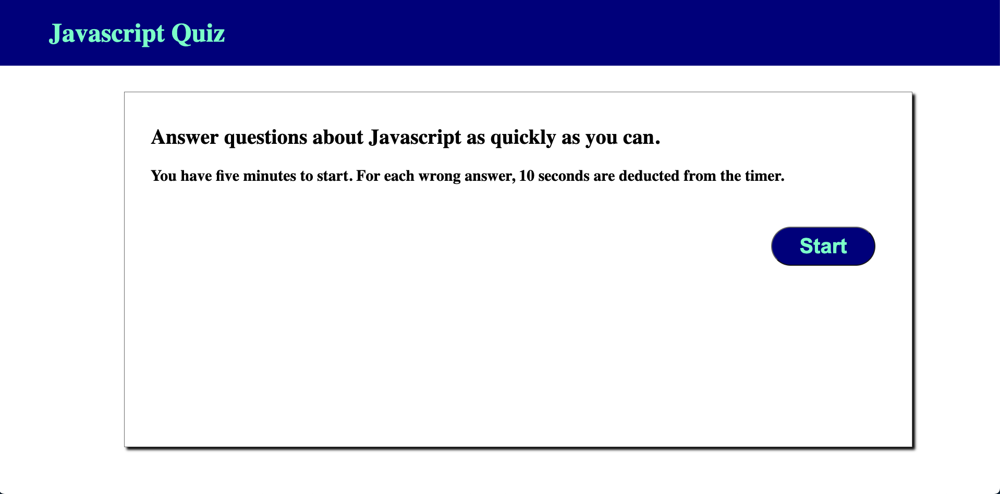
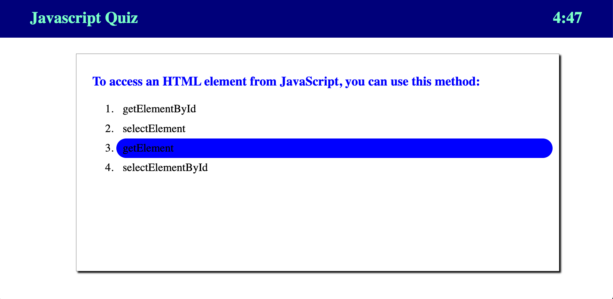
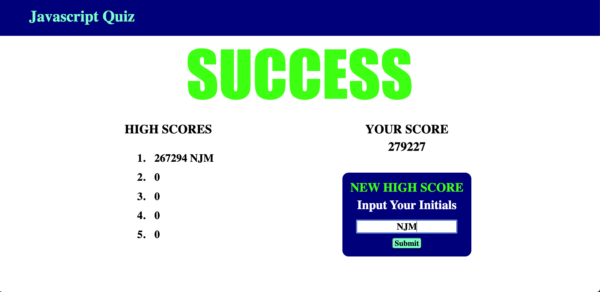

# UTA Coding Bootcamp Challenge 4 -- JavaScript Quiz

## Description

This is my submission for the fourth challenge in the UTA/EdX Coding Bootcamp. The goal of this challenge was to create an interactive quiz with JavaScript.
The website presents you with a series of questions related to JavaScript. Once you have correctly answered them all, you are given a score based on your time.

<a href="https://njmeister.github.io/Challenge-4-JSQuiz/">Link</a>

## Installation

N/A

## Usage
The website first presents you with an introduction to the quiz. Upon starting, you will be presented with a series of multiple-choice questions. If you choose incorrectly, 10 seconds are subtracted from the 5-minute timer, 
and the question is reentered at the end of the quiz. Once you answer all the questions correctly, you will be presented with a score based on the time it took you to complete. If your score is in the top 5 high scores 
saved locally, you are presented with an opportunity to add your initials to the displayed high scores.

## Credits

N/A

## License

This repo uses an MIT License. See above for details.
